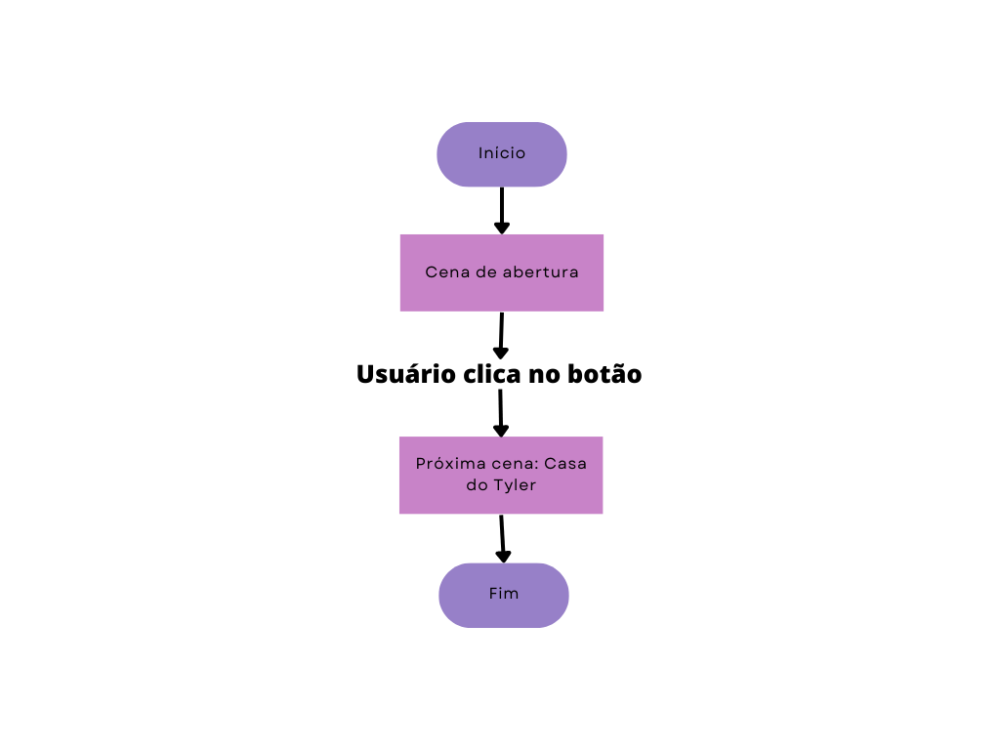
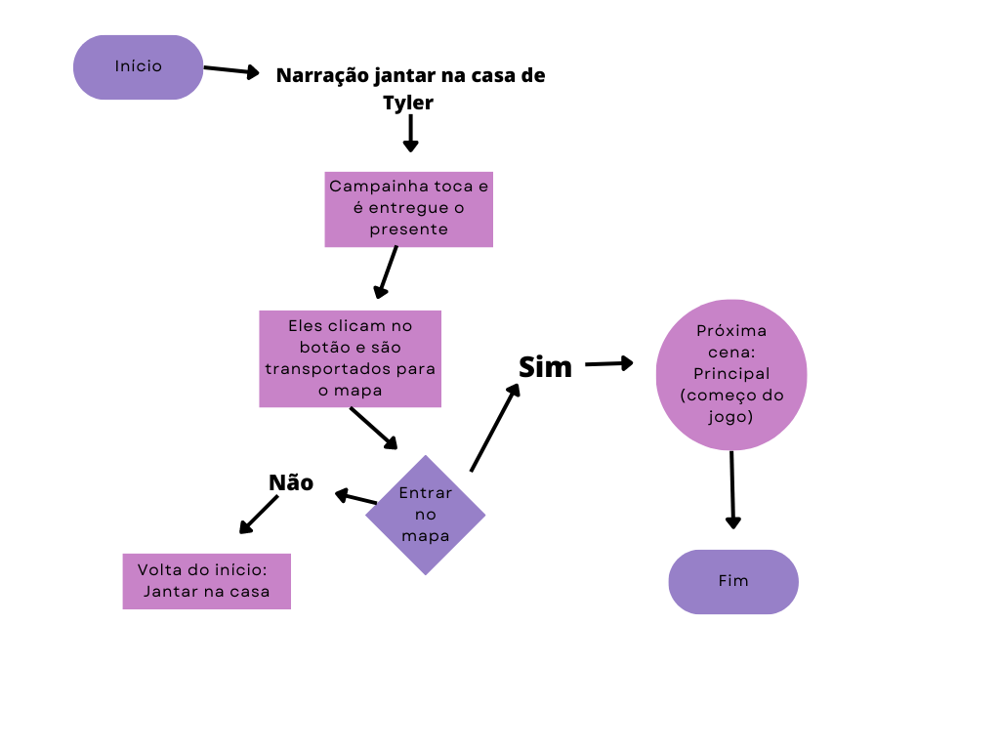
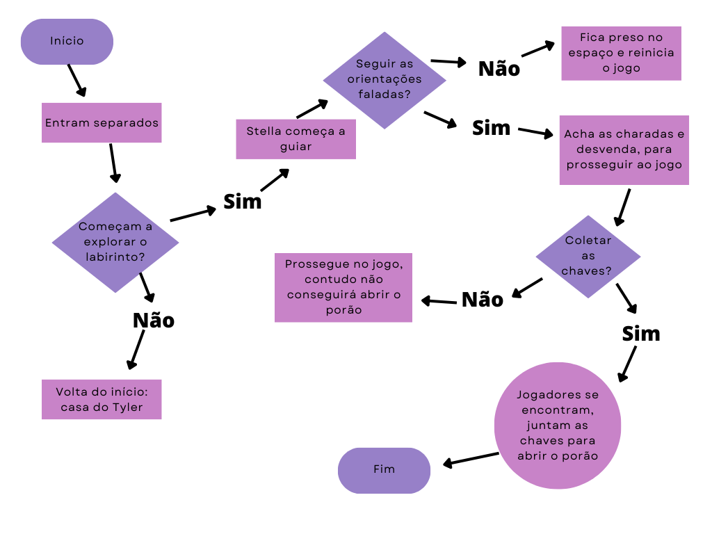
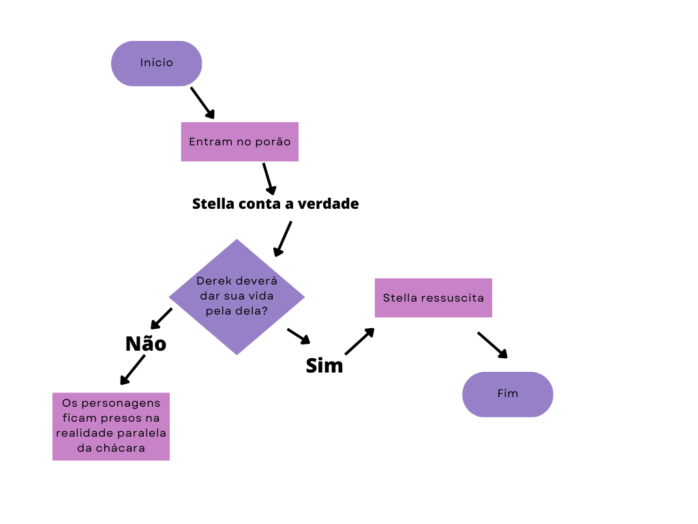

# **Maze of the past** 

## Premissa

Tyler e Derek eram amigos de infância que se conheciam desde sempre. Eles tinham uma forte amizade e estavam sempre juntos.Alguns dias antes do aniversário deles, ocorreu um jantar na casa de Tyler, e uma caixa misteriosa apareceu na porta de sua casa. Ficaram curiosos para saber o que havia dentro da caixa e decidiram levá-la ao quarto para abri-la juntos. O que eles não sabiam, era que o presente dentro da caixa iria mudar suas vidas de uma forma que eles nunca poderiam imaginar.

## Jogo Ideal

Em um mundo "normal", dois amigos inseparáveis, Tyler e Derek, que cresceram juntos como vizinhos e praticamente irmãos, levavam uma vida maravilhosa, sem problemas aparentes. Passavam a maior parte do tempo na casa um do outro e estudavam juntos na mesma escola. Tudo parecia perfeito até uma sexta-feira de Outubro, quando suas vidas foram completamente viradas do avesso.

Naquela noite, eles estavam animados com a proximidade de seus aniversários, que coincidem no mesmo dia e horário, quando a campainha tocou. Pensando ser um dos familiares que ainda não havia chegado, Tyler e Derek foram atender a porta, mas se surpreenderam ao encontrar uma caixa embrulhada em papel de presente. Sem entenderem por que um presente desconhecido estava ali, começaram a abrir a caixa. Nesse exato momento, todos os familiares que estavam reunidos na casa de Tyler, receberam uma mensagem de um familiar, pedindo que saíssem para encontrá-lo na estrada, pois estava perdido para achar a casa.

Apesar do pedido, Tyler e Derek decidiram ignorá-lo e continuar a abrir o presente, ansiosos para ver o que havia dentro. Encontraram uma mensagem que dizia para irem ao quarto de Tyler, onde estariam seus verdadeiros presentes. Sem entender o que estava acontecendo, mas curiosos, foram ao quarto e encontraram uma caixa com um grande botão vermelho. Ao apertá-lo, nada aconteceu, e eles ficaram desapontados com a suposta surpresa. Mas Derek, determinado a descobrir o que estava acontecendo, apertou o botão novamente, e foi aí que tudo mudou.

Eles saíram do quarto e se depararam com um labirinto que, para sua surpresa, era o lugar onde haviam passado toda a sua infância, a chácara. No entanto, o lugar estava abandonado e em ruínas, completamente diferente do que se lembravam. Enquanto caminhavam pelo labirinto, ouviam vozes estranhas que afirmavam que suas vidas eram uma mentira, que as pessoas ao seu redor eram impostores. Tudo parecia surreal e assustador, e eles não sabiam o que pensar. Será que era um sonho? Por que eles estavam revivendo o passado? Será que suas vidas eram uma mentira? 

Com muitas perguntas e poucas respostas, cabe a você, jogador, desvendar os mistérios por trás desse enredo intrigante e cheio de mistérios.

## Regras

- Jogo em 2D;
- Se passa em RPG;
- Os jogadores deverão desvendar todas as charadas em ordem;
- Poupar energias e coletar ao longo do jogo;
- Caso um jogador perca sua energia, ficará preso na chácara da família do Tyler e precisará reiniciar o jogo;
- Os jogadores irão jogar separadamente para no final descobrir o objetivo; 
- Ouvir as vozes que o guiarão para a verdade;
- Coletar as chaves para abrir o porão;

## Objetivo

Desvendar o mistério apresentado pelo labirinto e saber o motivo do passado ter voltado à tona.

## Fluxograma das cenas 

CENA 1: Entrada 

CENA 2: Contextualização

CENA 3: Labirinto do jogo 

CENA 4: Encerramento

## Referências

Cenário:
- Stranger Things; 
- O Iluminado;
- The Maze Runner.

Jogos inspiração: 
- Stranger Things: 1984;
- Super Mario Run;
- The Witch's House.

## Receita

- Versão premium - retirar propagandas passadas ao decorrer do jogo, pacotes com número específico de dicas extras (loot box);
- Propagandas - a cada pista encontrada irá ter um vídeo de propaganda com 15s

